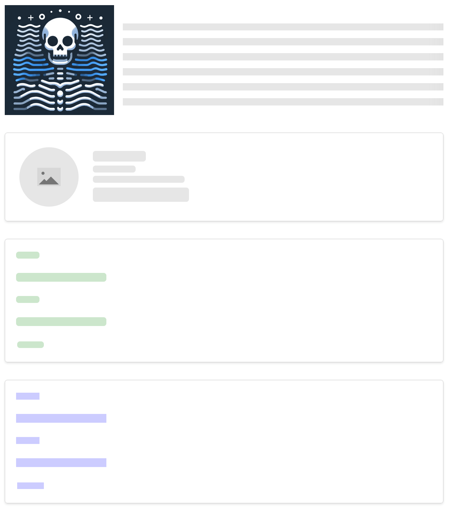

# Pulsable

A simple and customizable JavaScript library to add a pulsing/skeleton loading effect to your specific html section.

**[Code Sandbox Link](https://codesandbox.io/s/pulsable-kyzztl?file=/src/App.js)**



### Importing
```js
const setPulsing = require("pulsable");
or
import setPulsing from "pulsable";

// css path: "pulsable/index.css"
```

### using CDN
[CDN Link](https://www.jsdelivr.com/package/npm/pulsable)

### css with CDN
```html
<link rel="stylesheet" href="https://cdn.jsdelivr.net/npm/pulsable/dist/index.css" />
```

### How to trigger effect and stop it
```jsx

### importing css
```jsx
import "pulsable/dist/pulsable.css";
```

const yourContainerElement = document.getElementById("your-container-element");

setPulsing({
    rootElement: yourContainerElement,
    config: {
    animation,
    bgColors,
    noRadius,
    noPadding,
    },
    loading: true,
});
```

### How to design your element block

```jsx
<form id="your-container-element">
    <label htmlFor="name" className="pulsable">
    Name:
    </label>
    <div className="pulsable">
    <input type="text" id="name" />
    </div>

    <label htmlFor="email" className="pulsable">
    Email:
    </label>
    <div className="pulsable">
    <input type="email" id="email" />
    </div>

    <button className="pulsable" type="submit">
    Submit
    </button>
</form>
```

## Usage Guide

The method `setPulsing` takes an object with the following properties:
- `rootElement`: the element that contains the section you want to add the pulsing effect to.
- `loading`: a boolean that indicates whether the pulsing effect should be shown or not.
- `config`: an object that contains the configuration for the pulsing effect. It has four properties:
    - `animation`: the animation type of the pulsing effect. It can be one of the following:
        - `wave`: the default animation type. It's a wave that moves from left to right.
        - `wave-reverse`: a wave that moves from right to left.
        - `pulse`: a pulse animation that moves from left to right.
        - `none`: no animation.
    - `bgColors`: an object that contains the background colors for the pulsing effect. It has two properties:
    - `light`: the light color of the background.
    - `medium`: the medium color of the background.
    - `noRadius`: a boolean that indicates whether the pulsing effect should have rounded corners or not. By default it has rounded corners.
    - `noPadding`: a boolean that indicates whether the pulsing effect should have padding in each skeleton items or not. By default it has padding.

> check [example](https://codesandbox.io/s/pulsable-kyzztl?file=/src/App.js) for more.

### Conditions:

- You must provide a rootElement to the `setPulsing` method.
- You must provide loading property to the `setPulsing` method.
- You can use the `className="pulsable"` to add the pulsing effect to any element.
- if your element is a self closing tag like `` you should have to wrap it with div and add `pulsable` class to that. 
- if you want to hide some element while loading add class name `pulsable-hidden`
- if you want to add image icon in skeleton add class name `pulsable-img`
- for the paragraph use classname `pulsable-para`

- As Shown in example, for better performance you can use `flex` and  `align-items: flex-start` in parentNode to avoid the pulsing effect from stretching the element. you can also add these styles conditionally wihile loading, if it's affecting your design.


## React Support 

for the react use library [react-pulsable](https://www.npmjs.com/package/react-pulsable)
